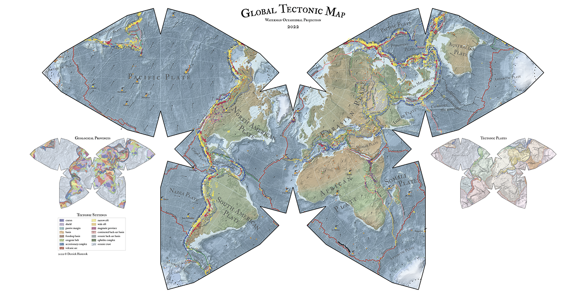

# Global Tectonics

The global_tectonics package is a set of shapefiles that can be used for analysis of Earth science data.  For each shapefile, there is an associated *.gmt file in Generic Mapping Tools (GMT) vector format.  There are several models as part of the package, which includes a present-day plate model and a geologic province model.  The models include metadata that permit the creation of several related (and seamless) maps including the lithospheric type (oceanic/continental), last orogenic event, and oceanic domains.

Details about the construction of the models is discussed in Hasterok, D., Halpin, J., Hand, M., Collins, A., Kreemer, C., Glorie, S., (submitted) New maps of global geologic provinces and tectonic plates, Earth Science Reviews.

## Latest Updates

**May 22, 2022**

Updated plates, boundaries, oc_boundaries and global_gprv following review.  Formats are provided as shapefiles (shp), generic mapping tools (GMT), and keyhole markup language (KML) for use with Google Earth, each in separate folders.

2021 July 19

## Included Files

* [plates.shp](plates&provinces/shp/plates.shp)
  
  Polygons of tectonic plates and crust types

* [boundaries.shp](plates&provinces/shp/boundaries.shp)
  
  Lines of plate boundary types

* [oc_boundaries.shp](plates&provinces/shp/oc_boundaries.shp)
  
  Lines demarcating the ocean-continent boundary

* [global_gprv.shp](plates&provinces/shp/global_gprv.shp) 
  
  Polygons of global geologic provinces
  
* [cratons.shp](plates&provinces/shp/cratons.shp)
  
  Regions with geochemical samples or that are known to have Archean (>2500 Ma) basement;  the polygons have largely been extracted from global_gprv.shp aside from a few in the western US from [Lund et al. (2015)](https://doi.org/10.3133%2Fds898) an additional column in the attribute table has been added to identify post-Archean reworking

## Contributing

The model is intended to be updated as new knowledge is gained about the locations and processes affecting provinces.  To do so requires community effort.  The global_tectonics GitHub repository can facilitate these updates.

If you wish to contribute to this project, contact derrick.hasterok@adelaide.edu.au or fork this repo and submit a pull request.

## How to cite

Hasterok, D., Halpin, J., Hand, M., Collins, A., Kreemer, C., Gard, M.G., Glorie, S., (revised) New maps of global geologic provinces and tectonic plates, Earth Science Reviews. Preprint available (EarthArXiv) https://doi.org/10.31223/X5TD1C

## Alternative versions

A [static version](doi.org/10.5281/zenodo.5093930) with additional global geophysical and tectonic datasets can be found with a QGIS project file on Zenodo data repository.  

Hasterok, D., Halpin, J., Hand, M., Collins, A., Kreemer, C., Glorie, S., New maps of global geologic provinces and tectonic plates: global tectonics data and QGIS project file, Zenodo, 10.5281/zenodo.5093930

## Publication history
submitted to Earth Science Reviews 18th May 2022
revised 23rd May 2022
accepted 26th May 2022
